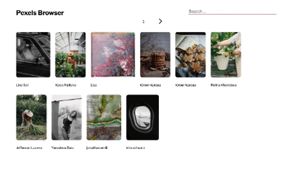

# Pexels Browser ✨📸✨

Pexels Browser is a website to let users browse photos from Pexels! Visitors are greeted with a selection of curated photos and are able to search our extensive catalog of quality photos from professional photographers. ✨📸✨

To get this React app started, first fork and clone this repo, then run `npm i && npm start`

  

You will need to create your wn API Key to access the Pexels API. Creating a key is free and only requires an account. Get started here: https://www.pexels.com/onboarding Once you've got your key, you can paste it in place of the API_KEY variable at the top of the PicListContainer.js file.

### Info about the React Components

#### `<App/>`

The top level component is be the `<App />` component. It is responsible for rendering the `<PicListContainer />` component.

#### `<PicListContainer />`

`<PicListContainer />` is a container that does data fetching and then renders its corresponding sub-component. 

#### `<PicList />`

`<PicList />` is a _presentational_ component. It receives data from its props
and renders html given the input data. It renders each image and the photographer's name within a link tag to that photographer's url.

#### `<PicSearchPaginate />`

The `<PicSearchPaginate />` component renders a form that receives the user input for the Pexels search. The text input is a _controlled component_ that
stores the value of the input in its component state and renders the DOM
accordingly. 

`<PicSearchPaginate />` receives a callback prop from its parent. On a submit event, it invokes that callback prop with the value of the text input. It is this callback function, defined in `<PicListContainer />`, that actually querys the API with the text the user entered.